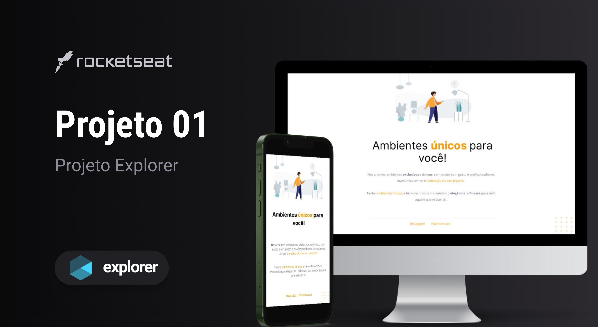

<h1 align="center"> Projeto-01 I Explorer 
    #Desafios Rocketseat </h1>

ATENÇÃO!!!
 
Este é um projeto conceitual e não representa uma empresa ou serviço real. Ele foi criado com o propósito de ser adicionado ao meu portfólio, demonstrando minhas habilidades e capacidades em projetos de design e desenvolvimento.  
<a href="https://rocketforms.typeform.com/to/fPcSmBp9#referral_id=e8eb53b2-1777-4867-9b33-d468fc9d1422o">Estude esse projeto em formato de vídeo clicando aqui.</a>

  <a href="#-tecnologias">Tecnologias</a>&nbsp;&nbsp;&nbsp;|&nbsp;&nbsp;&nbsp;
  <a href="#-projeto">Projeto</a>&nbsp;&nbsp;&nbsp;|&nbsp;&nbsp;&nbsp;
  <a href="#-layout">Layout</a>&nbsp;&nbsp;&nbsp;|&nbsp;&nbsp;&nbsp;
  <a href="#memo-licença">Licença</a>

  

 

  

## 🚀 Tecnologias

Esse projeto foi desenvolvido com as seguintes tecnologias:

- HTML e CSS
- Code Pen
- Git e Github
- Figma

## 💻 Projeto

O Projeto 01 é um site básico com o intuito de divulgar um serviço de decoração e design de interiores. Este projeto possui dois links principais:

- [Instagram da Empresa ](http://127.0.0.1:5500/Index.html)

- [E-mail da empresa para contato ](https://lp.rocketseat.com.br/devlinks/inscricao?utm_source=github&utm_medium=descricao&utm_campaign=capture-devlinks&utm_term=organic&utm_content=descricao-github-mayk-brito)

## 🔖 Layout

Você pode visualizar o layout do projeto através [DESSE LINK](https://www.figma.com/file/jxC0dTEsBqe3k0OOs1mfsc/Explorer---Projeto-01-(Copy)?node-id=0%3A1&mode=dev). É necessário ter conta no [Figma](https://figma.com) para acessá-lo.

## :memo: Licença

Esse projeto está sob a licença MIT.

---

Feito com ♥ by Pablo Perdigão,aluno da Rocketseat :wave: [Participe comunidade Rocketseat!](https://discord.gg/rocketseat)